# 📖 Guía de Desarrollo y Evolución del Proyecto

Este documento narra el viaje de desarrollo del **Clasificador de Cáncer de Mama**, desde las pruebas manuales iniciales hasta la arquitectura final orquestada con Docker Compose. El objetivo es servir como una guía de aprendizaje para entender las decisiones técnicas tomadas en cada fase y como un manual práctico para futuros desarrollos.

---

## Fase 0: Entrenamiento del Modelo de Machine Learning

Antes de que la aplicación pueda hacer predicciones, necesita un modelo entrenado. Este proceso se realiza una sola vez (o cada vez que se quiera actualizar el modelo) y se encapsula en el script `breast_cancer_app/model/train_model.py`.

### Proceso de Entrenamiento

El script sigue un flujo de trabajo avanzado de Machine Learning:

1.  **Carga de Datos:** Se utiliza el dataset `Breast Cancer Wisconsin (Diagnostic)` de Scikit-learn.
2.  **Optimización de Hiperparámetros:** Se utiliza `GridSearchCV` para encontrar la mejor combinación de parámetros para el `RandomForestClassifier`.
3.  **Entrenamiento y Evaluación:** Se entrena el modelo optimizado y se evalúa con métricas completas (Accuracy, ROC-AUC, Recall).
4.  **Generación de Artefactos:** Se guardan múltiples archivos en la carpeta `artifacts/`:
    - `model.pkl`: El modelo serializado con `joblib`.
    - `feature_info.json`: Estadísticas detalladas de las 30 características.
    - `model_metrics.json`: Métricas de rendimiento del modelo.
    - `example_cases.json`: Casos reales (benigno, maligno, límite) para el frontend.
    - `*.png`: Visualizaciones como la matriz de confusión, curva ROC e importancia de features.


**Imagen de artefactos obtenidos tras el entrenamiento**


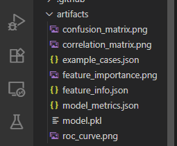

### Ejecución manual del entrenamiento sin Docker
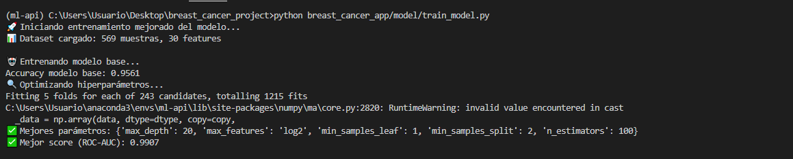

Evaluación del modelo tras el entrenamiento
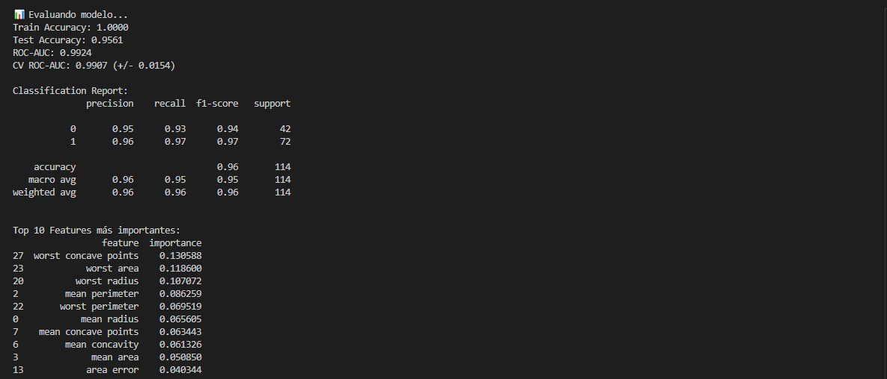

### ¿Cómo lo usa la API?

La API (`breast_cancer_app/api/api.py`) está diseñada para ser *stateless* en cuanto al entrenamiento. Simplemente carga los artefactos pre-entrenados (`model.pkl`, `feature_info.json`, etc.) cuando se inicia.

```python
# breast_cancer_app/api/api.py
model_data = joblib.load(os.path.join(ARTIFACTS_DIR, "model.pkl"))
```
Este desacoplamiento es crucial: el entrenamiento es un proceso de desarrollo/investigación, mientras que la predicción es una tarea de producción.

## Fase 1: Desarrollo y Pruebas Manuales (Sin Docker)

El proyecto comenzó con dos scripts de Python independientes: uno para la API (`breast_cancer_app/api/api.py`) y otro para el frontend (`breast_cancer_app/frontend/frontend.py`).

### Ejecución

1.  **API (Flask):** Se ejecutaba directamente. El servidor de desarrollo de Flask es ideal para esta etapa.
    ```bash
    python breast_cancer_app/api/api.py
    ```
    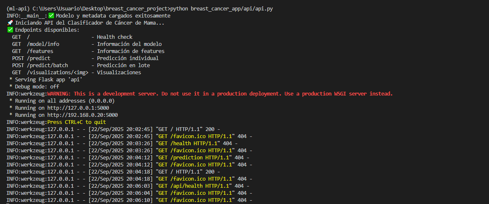

2.  **Frontend (Streamlit):** Se lanzaba en una terminal separada.
    ```bash
    streamlit run breast_cancer_app/frontend/frontend.py
    ```
    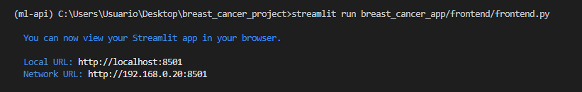
    
### Evolución de las Pruebas de la API

Las pruebas evolucionaron en tres etapas para aumentar la robustez y la automatización.

#### 1. Pruebas Manuales con `curl`

Las primeras validaciones se hicieron con `curl` para asegurar que los endpoints básicos respondían correctamente. Este método es rápido pero manual, repetitivo y propenso a errores.

**Prueba de endpoint raíz (`/`):**

```bash
curl http://127.0.0.1:5000/
```
 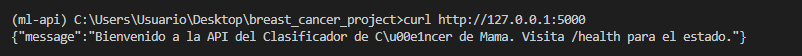


**Prueba de salud (`/health`):**

```bash
curl http://127.0.0.1:5000/health
```
 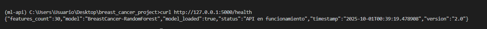

**Prueba de Predicción - Caso Benigno (para CMD de Windows):**
```bash
curl -X POST http://127.0.0.1:5000/predict -H "Content-Type: application/json" -d "{\"features\": [13.54, 14.36, 87.46, 566.3, 0.09779, 0.08129, 0.06664, 0.04781, 0.1885, 0.05766, 0.2699, 0.7886, 1.852, 23.56, 0.008462, 0.0146, 0.02387, 0.01315, 0.0198, 0.0023, 15.11, 19.26, 99.7, 711.2, 0.144, 0.1773, 0.239, 0.1288, 0.2977, 0.07259]}"
```
 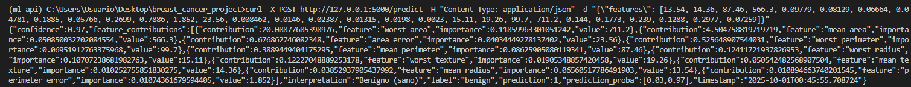

**Prueba de Predicción - Caso Maligno (para CMD de Windows):**
```bash
curl -X POST http://127.0.0.1:5000/predict -H "Content-Type: application/json" -d "{\"features\": [17.99, 10.38, 122.8, 1001.0, 0.1184, 0.2776, 0.3001, 0.1471, 0.2419, 0.07871, 1.095, 0.9053, 8.589, 153.4, 0.006399, 0.04904, 0.05373, 0.01587, 0.03003, 0.006193, 25.38, 17.33, 184.6, 2019.0, 0.1622, 0.6656, 0.7119, 0.2654, 0.4601, 0.1189]}"
```

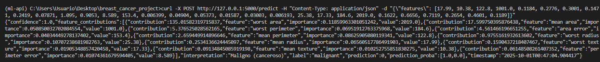

**Prueba de Predicción datos erróneos-(para CMD de Windows):**
```bash
curl -X POST http://127.0.0.1:5000/predict -H "Content-Type: application/json" -d "{\"features\": [1, 2, 3]}"
```
 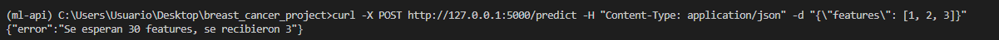

> **💡 Nota sobre la salida de la API:**
> La API devuelve un JSON. Para una visualización más clara en la terminal, se puede usar `| python -m json.tool` al final del comando `curl`.
>
> **Correspondencia de Clases:**
> - `prediction: 0` = **Maligno**
> - `prediction: 1` = **Benigno**

#### 2. Pruebas Semi-Automatizadas con un Script (`test_api.py` inicial)

Para superar las limitaciones de `curl`, se creó un script de Python (`test_api.py`) que ejecutaba una secuencia de pruebas y mostraba un resumen en la consola. Este script se ejecutaba inicialmente a través del servicio `tester` de Docker.

```bash
# Enfoque inicial, ya no se usa
python tests/test_api.py
```
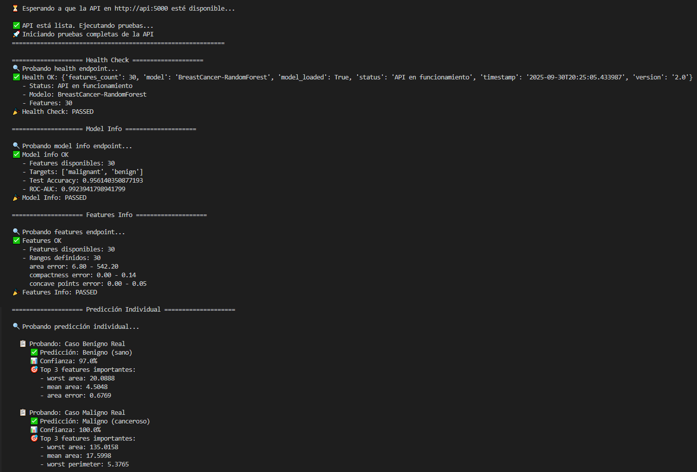

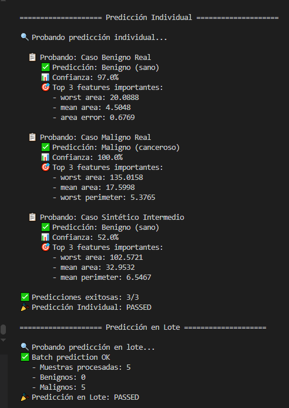

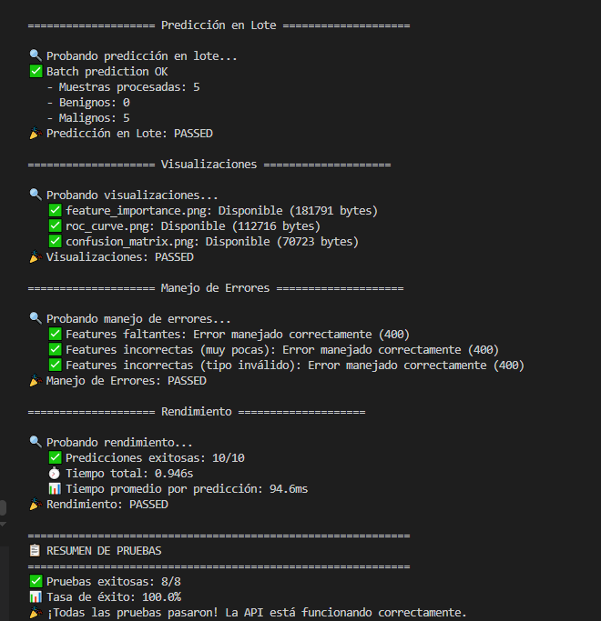

**Limitación:** Aunque era mejor que `curl`, este enfoque requería lógica manual para contar éxitos/fracasos y no se integraba bien con los frameworks de CI/CD modernos.

#### 3. Pruebas Profesionales con `pytest`

Pensando en la robustez y en la automatización para producción (CI/CD), la solución final fue refactorizar `test_api.py` para usar `pytest`, el estándar de la industria. `pytest` descubre y ejecuta las pruebas automáticamente, proporciona aserciones potentes y genera informes detallados.

Este es el método que se utiliza en la configuración final del entorno Dockerizado.
```bash
# Este comando se ejecuta dentro del contenedor 'tester' en la fase de Docker
pytest /app/tests
```
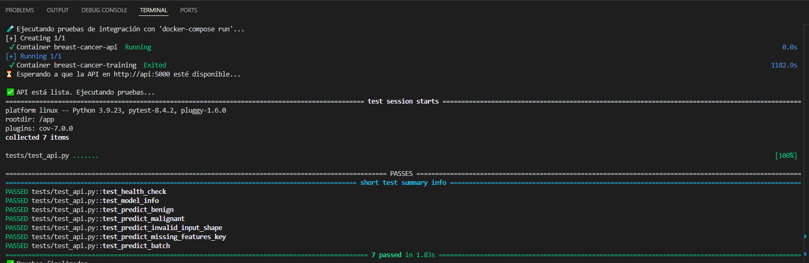


## Fase 2: Orquestación Profesional con Docker Compose

Para resolver las limitaciones del desarrollo manual y adoptar las mejores prácticas de MLOps, el proyecto salta directamente a una arquitectura de microservicios orquestada con `docker-compose`.

### La Solución: Servicios Separados y Desacoplados

`docker-compose.yml` define la aplicación como un conjunto de **servicios** interconectados, cada uno con una única responsabilidad:

1.  **Servicio `training`:** Un contenedor temporal que ejecuta `train_model.py` para generar los artefactos.
2.  **Servicio `api`:** Un contenedor que ejecuta la API de Flask con `waitress`. Depende de que `training` termine exitosamente.
3.  **Servicio `frontend`:** Un contenedor que ejecuta Streamlit. Depende de que `api` esté en funcionamiento.
4.  **Servicio `tester`:** Un contenedor temporal que ejecuta `test_api.py` contra la `api`.

Docker Compose se encarga de:
-   **Construir una única imagen** a partir del `Dockerfile` que será usada por todos los servicios.
-   **Crear una red virtual** para que los contenedores se comuniquen entre sí. El frontend puede llamar a la API usando su nombre de servicio (`http://api:5000`).
-   **Gestionar el ciclo de vida** de la aplicación con comandos simples o a través del script `start.sh`.

---

### Flujo de Ejecución con Docker Compose

El flujo de trabajo se simplifica enormemente con el script `start.sh`:
```bash
# Ejecuta todo el pipeline: limpiar, construir, entrenar y desplegar
./start.sh
```
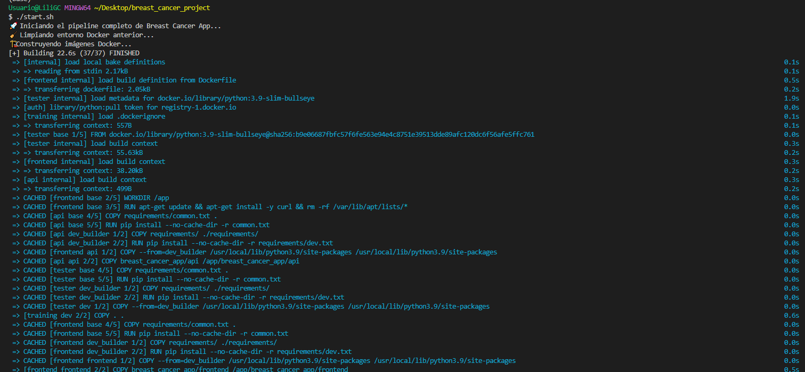

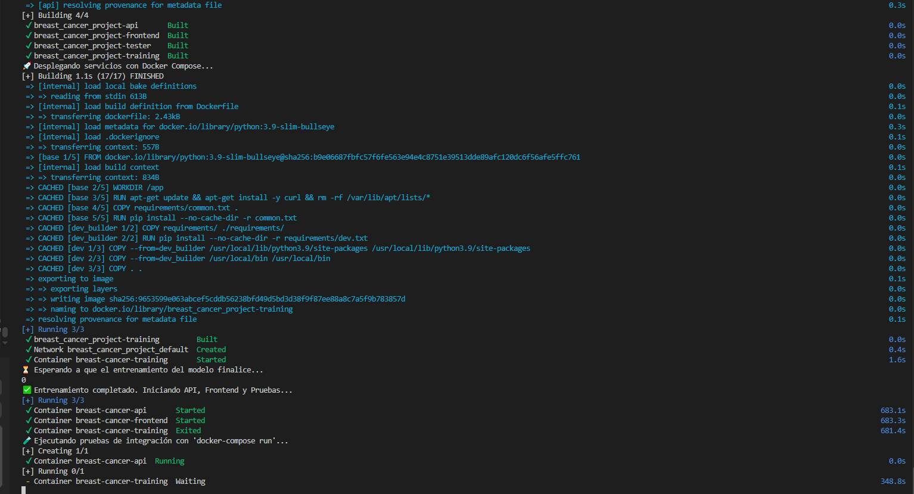

Comprobación de que todos los contenedores están corriendo y estado:
```bash
docker ps -a
```
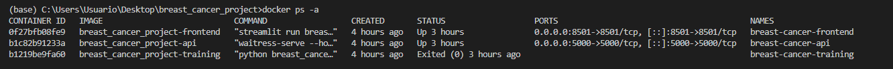

Comprobación de las imágenes construidas en docker-compose
```bash
docker images
```
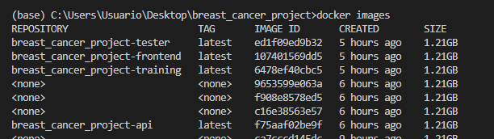:

### Acceso a la Aplicación
-   **Frontend (Streamlit):** [http://localhost:8501](http://localhost:8501)
-   **API (Flask):** [http://localhost:5000](http://localhost:5000)

**Vista de la Api desde la web**
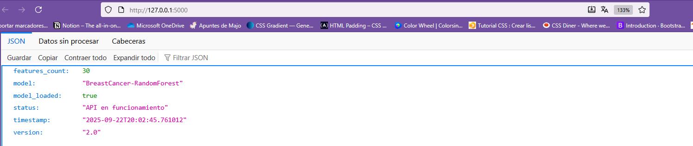

**Vista del Frontend desde la web**
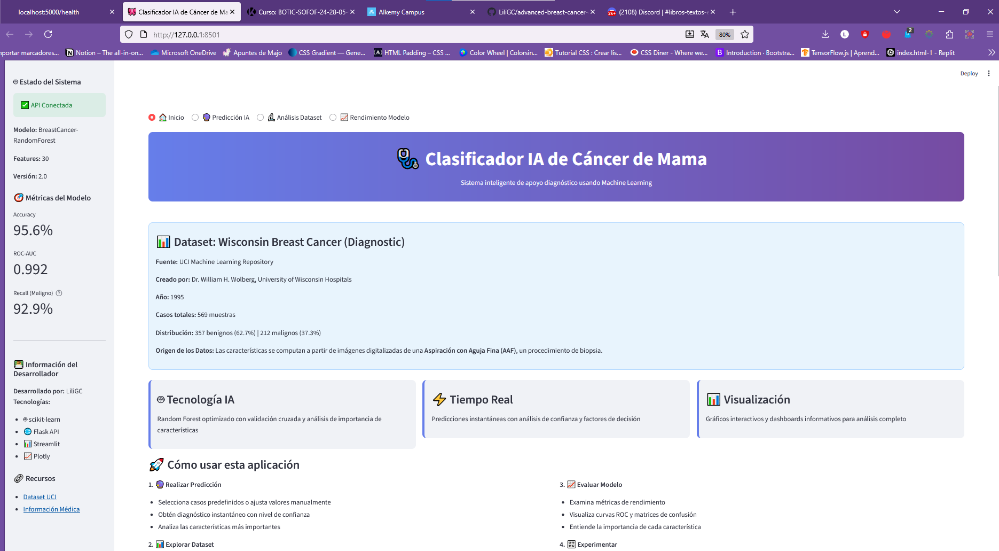

**Vista del Frontend desde la web con un caso maligno**
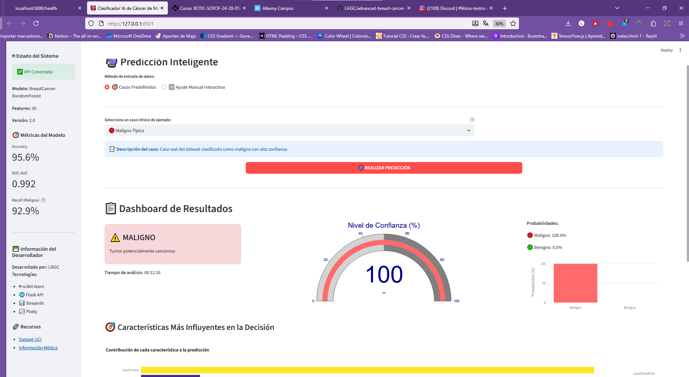

**Vista del Frontend desde la web con control manual de características**
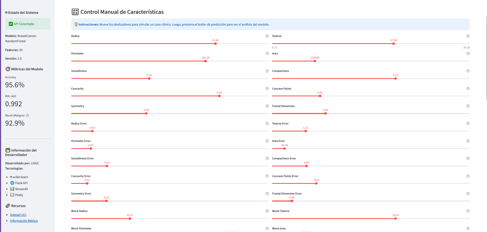
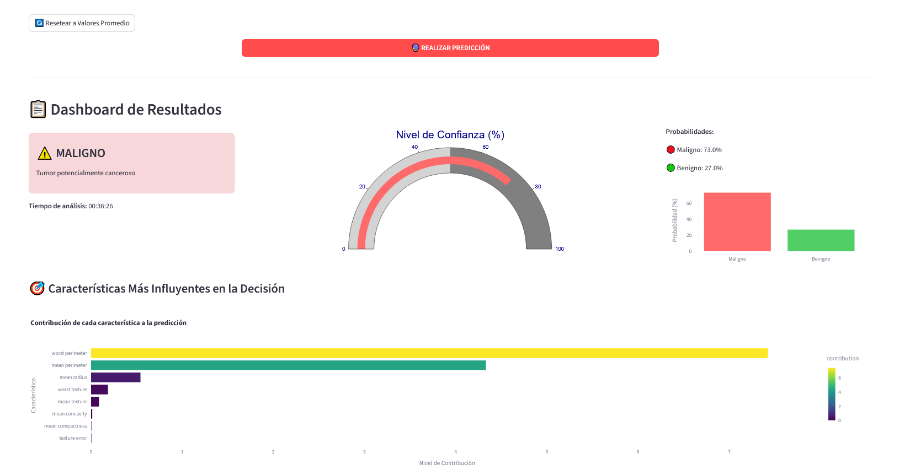

### ¿Por qué esta Arquitectura?
**Ventajas:**
-   **Alineado con las mejores prácticas:** Un proceso por contenedor.
-   **Escalable y mantenible:** Cada parte de la aplicación es independiente.
-   **Pipeline reproducible:** Todo el proceso, desde el entrenamiento hasta el despliegue, está automatizado y es consistente.

---

## `Dockerfile` vs. `docker-compose.yml`: La Clave para Desarrollo y Producción

Es fundamental entender el rol de cada archivo en este flujo de trabajo profesional:

*   **`Dockerfile` (La Receta de Cocina):**
    *   **Propósito:** Define los pasos para construir **una sola imagen de contenedor**. Es la receta para empaquetar tu aplicación (API o Frontend) en una unidad ejecutable y aislada.
    *   **Uso en Producción:** **Esencial**. El pipeline de CI/CD (`ci-cd.yml`) utiliza este archivo para construir las imágenes finales que se despliegan en Google Cloud Run. Es el artefacto de despliegue.

*   **`docker-compose.yml` (El Director de Orquesta Local):**
    *   **Propósito:** Orquesta y conecta **múltiples servicios** (contenedores) en tu máquina local para simular el entorno de producción. Define redes, volúmenes y dependencias entre servicios.
    *   **Uso en Producción:** **No se utiliza**. Las plataformas en la nube como Google Cloud Run o Kubernetes tienen sus propios sistemas de orquestación, mucho más potentes. `docker-compose` es una herramienta exclusiva para el **desarrollo y las pruebas locales**.

En resumen, `docker-compose` utiliza la receta del `Dockerfile` para construir las imágenes que necesita y luego las dirige en tu máquina local. Para la producción en la nube, el pipeline de CI/CD toma esa misma receta (`Dockerfile`) y la usa para entregar las imágenes directamente al orquestador de la nube.

Esta arquitectura final es robusta, profesional y está lista para entornos de producción.